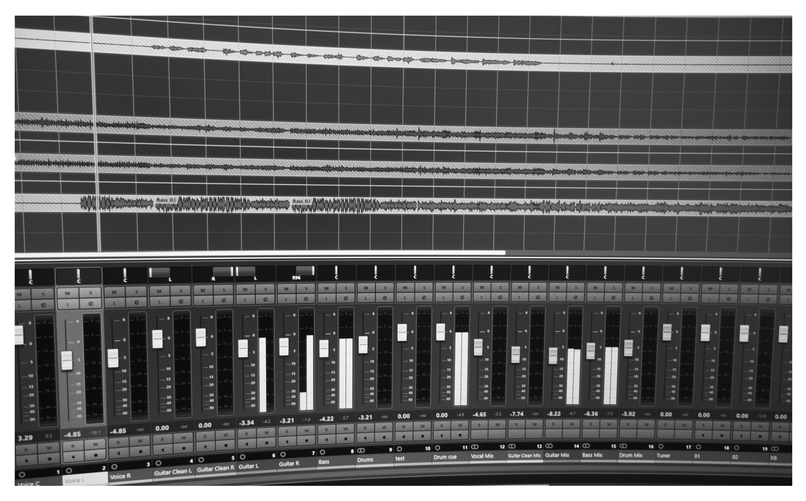

### Jouer à l’intuition et sans fausses notes

L’improvisation musicale repose sur la capacité d’un musicien à inventer, dans l’instant, une suite de notes cohérente et porteuse d’émotion, en s’appuyant sur la trame rythmique et harmonique des autres interprètes. Connaissant la partition à l’avance, il peut alors puiser dans son vocabulaire musical pour créer une mélodie qui dialogue avec le reste du groupe.

Plusieurs leviers créatifs entrent en jeu dans cette pratique. Dans les musiques populaires, par exemple, la tonalité et la gamme sont souvent imposées par la trame musicale, tandis que le rythme, l’intensité et surtout la dynamique des notes laissent davantage de place à l’expression personnelle.

Avec un instrument “classique” ou “traditionnel”, guitare, violon, piano, flûte, etc., maîtriser ces composantes demande du temps et de la pratique. Mais si l’on imagine un instrument capable de s’accorder automatiquement à une partition ou à une suite d’accords, il ne reste alors qu’à jouer avec ces leviers créatifs. 

C’est précisément la fonction du *Thereminuscule*. À travers ce programme, on s’affranchit des règles musicales formelles et des techniques propres à chaque instrument : il suffit de laisser parler son intuition pour guider la mélodie selon sa propre sensibilité, ou celle du système qui pilote le Thereminuscule.

### Le Thereminuscule 

Le *Thereminuscule*, ou plus précisément le *thereminuscule-engine*, est un programme informatique écrit en Python.

Il est conçu pour générer automatiquement des lignes mélodiques cohérentes et permet d’exploiter en temps réel n’importe quel flux de données entrant comme moyen d’interagir avec celles-ci, à la fois sur les notes mais aussi sur l’expressivité avec laquelle elles sont jouées.

⚡ Rendez-vous sur [GitHub](https://github.com/wildflux-experience/thereminuscule-engine) pour télécharger, installer et commencer à jouer avec le *Thereminuscule* !

### Les Nano-Modules

Les *Nano-Modules* sont des dispositifs électroniques simples et peu coûteux, capables de convertir des grandeurs physiques, au sens large, en flux de données numériques compatibles avec le *Thereminuscule*.

Ils assurent la passerelle entre monde réel et monde virtuel. Les façons mesurer l’effet d’une action, d’un mouvement ou d’un état, via une grandeur physique et un capteur adapté sont nombreuses, ouvrant ainsi la voie à une grande variété de *nano-modules* à imaginer !